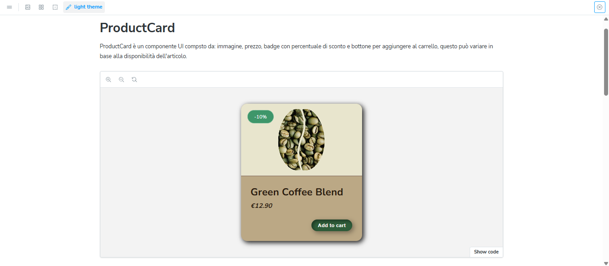
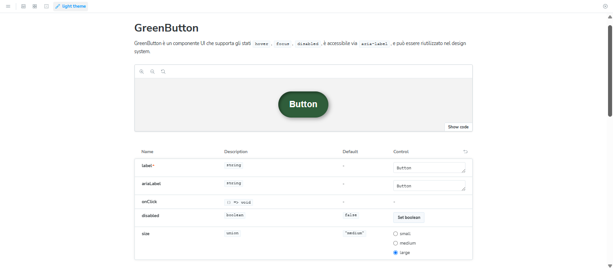

# ☕ Green Coffee Design System – Product Card Component

Benvenuto nel progetto **Green Coffee**, un sistema di design focalizzato sull'e-commerce di un ipotetico caffè artigianale.

Questa repository contiene due **componenti UI personalizzati** di cui una Card ed un Bottone;
Sviluppati in **React + TypeScript**, documentati in **Storybook** e progettati secondo i principi di accessibilità, coerenza visiva e responsive design.

---

## 📦 Contenuto

- ✅ Componente `ProductCard` riutilizzabile
- ✅ Componente `GreenButton` riutilizzabile
- 🎨 Palette di colori custom basata su variabili CSS (`--green`, `--beige`, `--brown`)
- 🧩 Varianti/stati: `normal`, `hover`, `sold out`, `badge`, `disabled`
- 💬 Tono di voce e testo coerenti (UX writing)
- 🔎 Contrasto verificato (WCAG AAA)
- 🌙 Tema chiaro/scuro
- 🧪 Documentazione interattiva via Storybook, presenti anche le documentazioni della tipografia e
  degli spazi.

---

## 🧑‍💻 Tecnologie utilizzate

- React 19 + TypeScript

- Storybook 8

- CSS Custom Properties

- Vite

- WCAG AAA Guidelines

